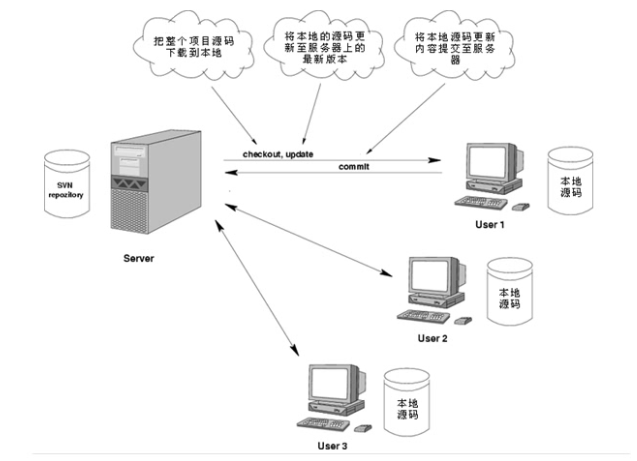
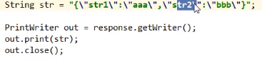
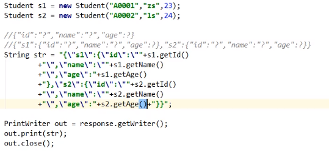

# 1.版本控制
**SVN（Subversion）**是集中式管理的版本控制器，而**Git**是分布式管理的版本控制器

* 集中式版本控制系统：

版本库是集中存放在中央服务器的,中央服务器就好比是一个图书馆，你要改一本书，必须先从图书馆借出来，然后回到家自己改，改完了，再放回图书馆.
集中式版本控制系统最大的毛病就是必须联网才能工作

* 分布式版本控制系统：

分布式版本控制系统根本没有"中央服务器"，每个人的电脑上都是一个完整的版本库

## 1.1 SVN
### 1.1.1 svn工作原理

# 2.重点知识回顾
## 2.1 ajax与jquery与js
**Ajax** 即“Asynchronous Javascript And XML”（异步 JavaScript 和 XML），是指一种创建交互式、快速动态网页应用的网页开发技术，无需重新加载整个网页的情况下，能够更新部分网页的技术。
通过在后台与服务器进行少量数据交换，Ajax 可以使网页实现异步更新。

**JavaScript**
 javaScript的简写形式就是JS，一种广泛用于客户端Web开发的脚本语言

**jQuery**是一个快速的，简洁的javaScript库,并且方便地为网站提供AJAX交互。

* 三者关系:**javaScript**是用于Web客户端开发的脚本语言，**Ajax**是基于JS语言，主要组合JS、CSS、XML三种技术的新技术，是用于创建交互式网页应用的网页开发技术。**jQuery**是JS的框架，基于JS语言，集合Ajax技术开发出来的JS库，封装JS和Ajax的功能，提供函数接口，大大简化了Ajax，JS的操作。

## 2.2 ajax的几种表现形式(jquery)

**$.ajax**:该形式是基于jquery的ajax的最标准表现形式，该形式功能齐全，应用的最广泛

**$.get/post**:该形式是基于上述的简写形式，使用更加方便，但是在保留了核心ajax功能的同时也去除了一些扩展功能。

**$.getJSON**:专门针对于json数据解析的形式

## 2.4 jquery存取值的理解

* 相当于原生js的document.getElementById("").value针对于表单元素的value属性值的存取值操作
例如 
	
		< input id="" value="">	
		< select>
			< option value="">
		< /select>

 * val(值):存值
 * val():取值

* 相当于原生js的document.getElementById("").innerHTML针对于标签对中的内容的存取值
该形式对于html元素，随着内容可以动态的赋予
例如
	
		< h1>xxxx</h1>
		html("< font color='red'>aaa< /font>")
 * html(值):存值
 * html():取值

与上述html()方法非常相似，不同的是，text()方法只针对于内容本身，不注重html元素的动态赋予
例如
	
		text("aaa")

 * text(值):存值
 * text():取值

## 2.5 ajax请求格式
		 $.ajax({
            url : "", //访问后台servlet地址
            data : {    //为后台传递的参数
              "key1" : "value1" ,
              "key2" : "value2"
            },
            type : "", //请求方式 get post
			dataType : "",//从后台接受数据的方式， text:普通文本, json:接收json格式的文本
			saync : true,
			success : function(data){ //回调函数(执行时机是后台执行完毕后，该函数才会执行)
				//data，从后台响应回来的数据
			}
          })

## 2.6 get请求和post请求

* get : 取，拿

 	在实际项目开发中，核心业务是以**查询**为目的，发出get请求

* post : 邮寄
	
	在实际项目开发中，核心业务是以**添加，修改，删除**为目的，发出post请求

如果遇到特殊需求，参数涉及到了安全性方面的问题，例如登录需要传递密码，我们仍然使用post方式 

## 2.7 ajax关于同步与异步
	
设置

* async:ture 异步
	
通过观察得到结果，ajax下面的代码(alert弹框)不会等ajax执行完毕，全程是两根线程，一根线程负责执行方法中的普通代码，一根线程执行ajax

* async:false 同步

从上到下依次执行

实际项目开发中，一般情况下，使用异步，可以有效提升用户体验，在特殊情况下，也会使用到同步

## 2.8 Json拼接练习
	
* 	json相当于前后端的媒介，后台将数据封装成对象，直接给前端，前端将会收到对象的地址，对于前端来说是无用的，因为前端js访问不到后台java的堆，因此我们使用JSON将对象解析为一个json串，通过它可以让前端拿到数据，一个JSON就是一个对象
	{"key":"value"} //键值对对象

	{"str1":"abc","num":100,"success":true}

使用json时，dataType为json，并通过json.key的方式取得key。例如:data.str1

**如图**

	

为什么使用{}对象，因为我们可以对对个相同或不同的数据进行封装，方便管理

* domain:邻域模型

	pojo，bean，javabean，实体类(数据库交互)

//拼接
	
	{"id":"?","name":"?","age":"?"}

	 String str = "";
		str = "{\"id\":\"?\",\"name\":\"?\",\"age\":\"?\"}";
        str = "{\"id\":\""+s.getId()+"\",\"name\":\""+s.getName()+"\",\"age\":\""s.getNage()"\"}"

后台往前端传数据，可以使用alert(data)判断，如果为object Object为Json对象，什么都没弹，说明json解析错误

* 使用多个对象怎么办?

既然可以在对象中套对象，为什么不可以在json中套json

	{"id":"?","name":"?","age":"?"}

{**"s1"**:{"id":"?","name":"?","age":"?"},**"s2"**:{"id":"?","name":"?","age":"?"}}

s1为一个对象，s2为一个对象，

拼接时，在()+之间回车，防止错误

**如图**

	