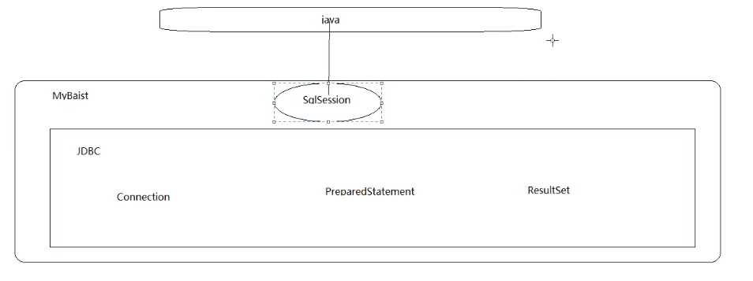
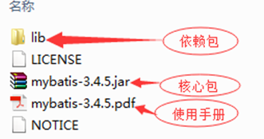
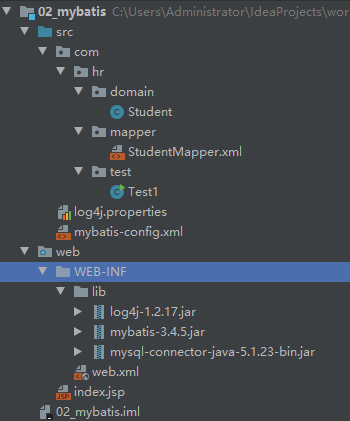

# 一、MyBatis框架

## 1.框架在开发中的作用以及常用框架
* java三层架构
	* 业务层（逻辑层、service层）
采用事务脚本模式。将一个业务中所有的操作封装成一个方法，同时保证方法中所有的数据库更新操作，即保证同时成功或同时失败。避免部分成功部分失败引起的数据混乱操作。

	* 表现层（JSP）
采用MVC模式。
M称为模型，也就是实体类。用于数据的封装和数据的传输。
V为视图，也就是GUI组件，用于数据的展示。
C为控制，也就是事件，用于流程的控制。

	* 持久层（DAO）
采用DAO模式，建立实体类和数据库表映射（ORM映射）。也就是哪个类对应哪个表，哪个属性对应哪个列。持久层的目的就是，完成对象数据和关系数据的转换。 

* 前端框架
	* 前端开发用的框架
		* Angular.js
		* React.js
		* Vue.js
	* 前端UI框架 
		* jquery UI
		* easy UI
		* bootstrap

* 后端框架
	* 表现层框架 (MVC)Controller: 现在先用servlet
		* struts
		* struts2(xwork)
		* springmvc
	* 持久层框架(Dao):JDBC
		* Hibernate(对sql进行高度封装形成hql)
		* MyBatis(ibatis)对jdbc几乎所有的数据库操作进行的封装
	* 整合框架
		* EJB
		* spring
		
* SSH: struts/struts2 spring hibernate
* SSM: springmvc spring mybatis 

* MyBatis
	
MyBatis是一个持久层框架，几乎对所有的数据库操作进行了封装(包括加载驱动，创建connection，statement对象等)，使开发者只需要关注sql本身

## 2.MyBatis框架搭建流程
	
### 2.1 MyBatis资源目录结构

### 2.2 搭建框架
* 准备工作在mysql中，创建学生表，插入基础数据
* 创建web项目，搭建包结构
* 导入mybatis相关jar包和mysql驱动包
* 导入log4j相关jar包(日志信息)
* 记得add as Library
* 在src根下创建**mybatis主配置文件mybatis-config.xml**，搭建配置文件结构。(模板在文档第三页)
* 创建mapper包结构，创建sql映射文件XxxMapper.xml(模板在文档第四页)
* 在src根下引入log4j属性文件
* 搭建测试程序，测试根据ID查单条
	

### 2.3 StudentMapper.xml映射文件配置
	<?xml version="1.0" encoding="UTF-8" ?>
	<!DOCTYPE mapper
	        PUBLIC "-//mybatis.org//DTD Mapper 3.0//EN"
	        "http://mybatis.org/dtd/mybatis-3-mapper.dtd">
	<!--
	    namespace:命名空间用于区分不同的mapper文件
	        不同的mapper映射文件所使用的namespace的命名不允许重复
	-->
	<mapper namespace="test1">
	    <!--
	    sql语句必须写在相应标签中
	       <insert>...
	
	       parameterType:为sql语句传递的参数 如本例中的id类型
	       resultType:sql语句返回的结果
	       我们之前的jdbc返回的是 ResultSet结果集对象
	        ResultSet rs = sql语句
	        Student  s = new Student();
	        if(rs.next()){
	            s.setId(rs.getString(1));
	            s.setNamed(rs.getString(2));
	            s.setAge(rs.getId(3));
	         }
	        现在直接自动创建对象
	            student s = sql语句
	         #{id} 等价于 ?
	    -->
	
	    <select id="getById" parameterType="java.lang.String" resultType="com.hr.domain.Student">
	        select  * from tbl_stu where id=#{id}
	    </select>
	</mapper>
### 2.4 mybatis主配置文件mybatis-config.xml

	<?xml version="1.0" encoding="UTF-8" ?>
	<!DOCTYPE configuration
	        PUBLIC "-//mybatis.org//DTD Config 3.0//EN"
	        "http://mybatis.org/dtd/mybatis-3-config.dtd">
	<configuration>
	    <environments default="development">
	        <environment id="development">
	            <transactionManager type="JDBC"/>
	            <dataSource type="POOLED">
	                <property name="driver" value="com.mysql.jdbc.Driver"/>
	                <property name="url" value="jdbc:mysql://localhost:3306/test"/>
	                <property name="username" value="root"/>
	                <property name="password" value="123456"/>
	            </dataSource>
	        </environment>
	    </environments>
	    <mappers>
	        <mapper resource="com/hr/mapper/StudentMapper.xml"/>
	    </mappers>
	</configuration>

### 2.5 test测试类
	public class Test1 {
	    public static void main(String[] args) {
	
	        String resource = "mybatis-config.xml"; //放在src根下
	        //输入流 读
	        InputStream inputStream = null;
	        try {
	            //通过加载mybatis的主配置文件。创建输入流对象
	            inputStream = Resources.getResourceAsStream(resource);
	        } catch (IOException e) {
	            e.printStackTrace();
	        }
	        /*
	        SqlSessionFactoryBuilder:SqlSessionFactory的建造者
	        通过SqlSessionFactoryBuilder对象调用建造方法，为我们创建一个SqlSessionFactory对象
	        SqlSessionFactory唯一作用就是为我们创建SqlSession对象
	        我们未来所有操作，使用的都是SqlSession对象
	        例如增删改查。处理事务
	        */
	        SqlSessionFactory sqlSessionFactory =
	                new SqlSessionFactoryBuilder().build(inputStream);
	        SqlSession session = sqlSessionFactory.openSession();
	
	        /*sql语句必须写在相应的标签中
	            如果取得的是单条记录，我们调用selectOne方法
	            参数1:根据命名空间.sqlId的形式找到使用的sql语句
	            参数2:为sql语句传递的参数
	         */
	
	        Student s = session.selectOne("test1.getById", "A0001");
	        System.out.println(s.toString());
	        session.close();
	    }
	}

**注意**: 

* mapper文件需注册在主配置文件中才会生效
* MyBatis手动提交事务
* mapper中select的resultType必须写，其他操作可以只写id属性

### 2.6 为什么使用MyBatis框架

* 1）获取连接、得到statement、处理rs、关闭资源非常繁琐。

	**解决**：使用SqlSession搞定一切

* 2）将sql语句写死到java代码中，如果修改sql语句，须要修改java代码，须要重新编译。程序可维护性不高。

	**解决**：将Sql语句配置在Mapper.xml文件中与java代码分离。
* 3) 向PreparedStatement对占位符的位置设置参数时，非常繁琐。

	**解决**：Mybatis自动将java对象映射至sql语句，通过statement中的parameterType定义输入参数的类型。

* 4）解析结果集时需要把字段的值设置到相应的实体类属性名中。

	**解决**：Mybatis自动将sql执行结果映射至java对象，通过statement中的resultType定义输出结果的类型。

## 3.MyBatis结合dao层开发
source code: 02_mybatis_01

我们在业务层使用动态代理,是因为业务层本身就是用来处理业务逻辑的，事务相关的代码放在业务层处理，所以我们想到使用代理类帮业务层去处理

现在我们在dao层也要加入动态代理。dao层之所以创建代理类，是因为dao层写dao层实现类本身就是一种不方便。在结合了mybatis的动态代理机制后，以后实际项目开发中，dao层的impl就不写了，且mybatis动态代理已经集成好了

规则:

* 1) XxxMapper.xml和实体类XxxDao放在同一文件夹下如Dao，将XxxMapper改名为XxxDao
* 2) 在Mapper.xml中将namespace设置为UserDao.java接口的全限定名(右键实体类选择copy reference)
* 3) 将Mapper.xml中statement的id和UserDao.java接口的方法名保持一致
* 4）将Mapper.xml中statement的resultType和UserDao.java接口的方法输出结果类型保持一致
