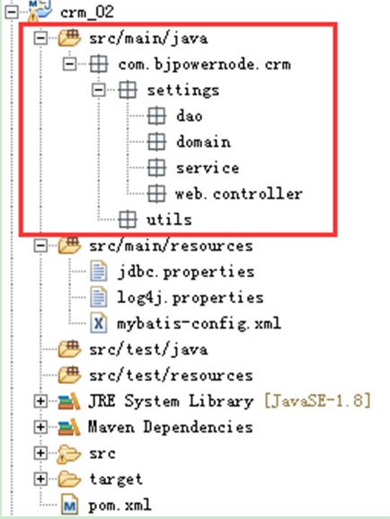

## 1.搭建CRM项目的开发环境
### 1.1 导入本地maven库
* 创建maven项目
* 本地maven库
* 导入本地maven库
### 1.2删除pom.xml中无用信息
* 只保留如下信息

		<?xml version="1.0" encoding="UTF-8"?>
		
		<project xmlns="http://maven.apache.org/POM/4.0.0" xmlns:xsi="http://www.w3.org/2001/XMLSchema-instance"
		 xsi:schemaLocation="http://maven.apache.org/POM/4.0.0 http://maven.apache.org/xsd/maven-4.0.0.xsd">
  		<modelVersion>4.0.0</modelVersion>

 		<groupId>com.hr</groupId>
  		<artifactId>projetdemo</artifactId>
  		<version>1.0-SNAPSHOT</version>
  		<packaging>war</packaging>

		</project>
### 1.3 创建目录结构
* 在main文件夹下建立java文件夹和resources文件夹
* 与main文件夹平级创建一个test文件夹
* test文件夹下创建java文件夹和resources文件夹

**注意：**为文件夹赋予功能（颜色）后，文件夹才会生效
### 1.4 导入web.xml模板
		
		<?xml version="1.0" encoding="UTF-8"?>
		<web-app xmlns:xsi="http://www.w3.org/2001/XMLSchema-instance" xmlns="http://java.sun.com/xml/ns/javaee" xsi:schemaLocation="http://java.sun.com/xml/ns/javaee http://java.sun.com/xml/ns/javaee/web-app_2_5.xsd" id="WebApp_ID" version="2.5">
		  <display-name>crm</display-name>
		  <welcome-file-list>
		    <welcome-file>index.html</welcome-file>
		  </welcome-file-list>
		  
		  <servlet>
		    <servlet-name>xxxController</servlet-name>
		    <servlet-class>xxx.xxxController</servlet-class>
		  </servlet>
		  <servlet-mapping>
		    <servlet-name>xxxController</servlet-name>
		    <url-pattern>/xxx/xxx.do</url-pattern>
		    
		  </servlet-mapping>
		  
		  
		</web-app>
	
### 1.5 通过pom.xml导入我们需要的jar包
* 在resource路径下引入开发用的配置文件和属性文件
	* jdbc.properties（修改数据库名）
	* log4j.properties
	* mybatis-config.xml
	* SqlMapper.xml（建立后台包结构后加入该文件）
### 1.6 创建数据库

### 1.7将crm原型拷贝到webapp目录下

### 1.8启动Tomcat服务器，测试

## 2.创建项目后端结构
### 2.1 目录结构

* 提供一些相关的工具类 (SqlSessionUtil等..)
* 搭建用户相关的domain、dao、service、controller
* 对于dao层命名的说明

