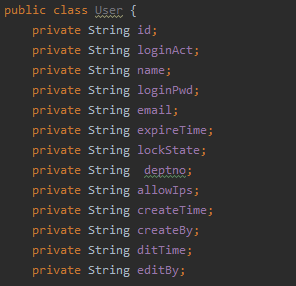
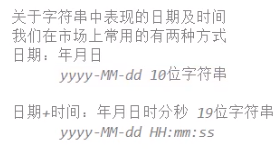
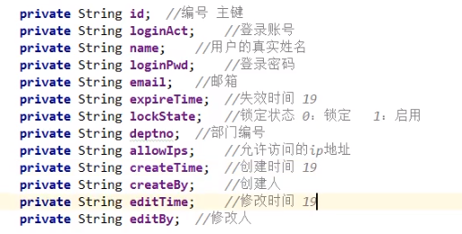

## 1.用户模块搭建
### 1.1 创建数据库字段
* 创建用户表

			create table tbl_user
		(
		   id                   char(32) not null comment 'uuid
		            ',
		   loginAct             varchar(255),
		   name                 varchar(255),
		   loginPwd             varchar(255) comment '密码不能采用明文存储，采用密文，MD5加密之后的数据',
		   email                varchar(255),
		   expireTime           char(19) comment '失效时间为空的时候表示永不失效，失效时间为2018-10-10 10:10:10，则表示在该时间之前该账户可用。',
		   lockState            char(1) comment '锁定状态为空时表示启用，为0时表示锁定，为1时表示启用。',
		   deptno               char(4),
		   allowIps             varchar(255) comment '允许访问的IP为空时表示IP地址永不受限，允许访问的IP可以是一个，也可以是多个，当多个IP地址的时候，采用半角逗号分隔。允许IP是192.168.100.2，表示该用户只能在IP地址为192.168.100.2的机器上使用。',
		   createTime           char(19),
		   createBy             varchar(255),
		   editTime             char(19),
		   editBy               varchar(255),
		   primary key (id)
		);
* 插入数据

			INSERT INTO `tbl_user` VALUES ('06f5fc056eac41558a964f96daa7f27c', 'ls', '李四', '202cb962ac59075b964b07152d234b70', 'ls@163.com', '2018-11-27 21:50:05', '1', 'A001', '192.168.1.1', '2018-11-22 12:11:40', '李四', null, null);
			INSERT INTO `tbl_user` VALUES ('40f6cdea0bd34aceb77492a1656d9fb3', 'zs', '张三', '202cb962ac59075b964b07152d234b70', 'zs@qq.com', '2018-11-30 23:50:55', '1', 'A001', '192.168.1.1,192.168.1.2,127.0.0.1', '2018-11-22 11:37:34', '张三', null, null);

### 1.2 创建domain实体类

### 1.3 配置dao(mapper)mybatis映射文件
* 创建UserDao类
* 创建UserDao.xml文件
	* 使用mybatis模板(在namespace写上路劲)
	
			<?xml version="1.0" encoding="UTF-8" ?>
			<!DOCTYPE mapper
			 PUBLIC "-//mybatis.org//DTD Mapper 3.0//EN"
			 "http://mybatis.org/dtd/mybatis-3-mapper.dtd">
			
			<mapper namespace="com.hr.crm.settings.dao.UserDao">
				
				
				
			</mapper>
* 在mybatis中的package填上路径
		 
		<typeAliases>
		  
		  	<package name="com.hr.crm.settings.domain"/>
		  	
		  </typeAliases>
		
		<mappers>
		   
		     <package name="com.hr.crm.settings.dao"/>
		    
		  </mappers>
### 1.4 创建UserService接口与实现类
	
		public class UserServiceImpl implements UserService {
	    private UserDao userDao = SqlSessionUtil.getSqlSession().getMapper(UserDao.class);
	}
### 1.5 创建userController及配置servlet
	   System.out.println("进入到用户控制器");
	
	        String path = request.getServletPath();
	
	        if ("/settings/user/xxx.do".equals(path)){
	            //xxx(request,response);
	        }else if ("".equals(path)){
	
	        }
	    }

## 2.用户登录操作
### 2.1用户字段解释

### 2.2登录操作
* 验证账号和密码
	* User user = select * from tbl_user where loginAct=? and loginPwd=?
	* 如果user对象为空，账户密码错误
	* 如果非空，继续验证其他字段信息
		* 从user中get到
			* expireTime 失效时间
			* LockState 锁定状态
			* allowIps 验证ip地址是否有效 
			
### 2.3 登录流程
* 时序图:用来描绘从浏览器到

### 2.4 修改html页面jsp